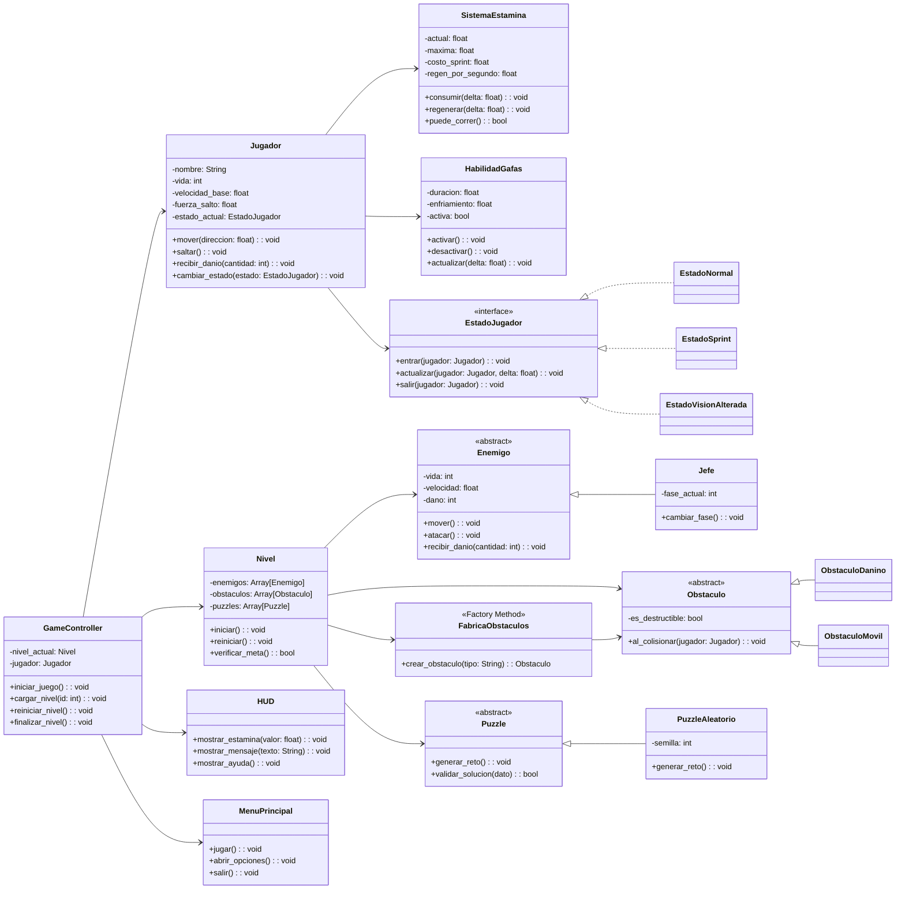

# UML propuesto para Deep Shadow

## Cambios clave frente al UML base

- Separar logica del juego de nodos visuales de Godot.
- Evitar una clase `Juego` demasiado grande.
- Mantener `Jugador`, `Enemigo`, `Jefe`, `Nivel` y `Obstaculo` como base del dominio.
- Agregar clases para mecanicas obligatorias: estamina, gafas, puzzle aleatorio y HUD.
- Usar patrones faciles de defender en clase:
  - `State` para el comportamiento del jugador.
  - `Factory Method` para crear obstaculos o puzzles aleatorios.
  - `Observer` por medio de senales de Godot para actualizar HUD y eventos.

## Notas de arquitectura

- Modelo: clases con reglas del juego.
- Vista: escenas Godot, sprites, animaciones, HUD y menu.
- Controlador: scripts que reciben input y coordinan modelo y vista.

Los nodos como `Sprite2D`, `CollisionShape2D` y `AnimationPlayer` no deben ser atributos centrales del modelo UML. Esos son detalles de la vista/escena en Godot.

## UML recomendado

## Patrones sugeridos

### 1. State

Aplicacion:
- `EstadoNormal`
- `EstadoSprint`
- `EstadoVisionAlterada`

Ventaja:
- evita llenar `Jugador` de `if` y `match`
- permite extender comportamientos sin romper la clase principal

### 2. Factory Method

Aplicacion:
- `FabricaObstaculos`
- despues se puede replicar a puzzles o enemigos

Ventaja:
- centraliza la creacion aleatoria
- ayuda a cumplir Open/Closed

### 3. Observer

Aplicacion:
- senales de Godot entre `Jugador`, `SistemaEstamina`, `Nivel` y `HUD`

Ventaja:
- el HUD no consulta todo el tiempo al jugador
- separa la UI de la logica del juego

## Orden recomendado para implementar

1. `Jugador`
2. `SistemaEstamina`
3. `GameController`
4. `Nivel`
5. `HUD`
6. `EstadoJugador` + `EstadoNormal` + `EstadoSprint`
7. `Obstaculo` + `FabricaObstaculos`
8. `PuzzleAleatorio`
9. `Enemigo`
10. `Jefe`
11. `HabilidadGafas`

## Primera meta tecnica

Un vertical slice jugable con:

- movimiento
- salto
- sprint con estamina
- un obstaculo aleatorio
- un enemigo simple
- HUD
- un puzzle corto
- pantalla de inicio y reinicio

Si eso queda estable, despues agregan jefe, vision alterada y mas pulido visual.
