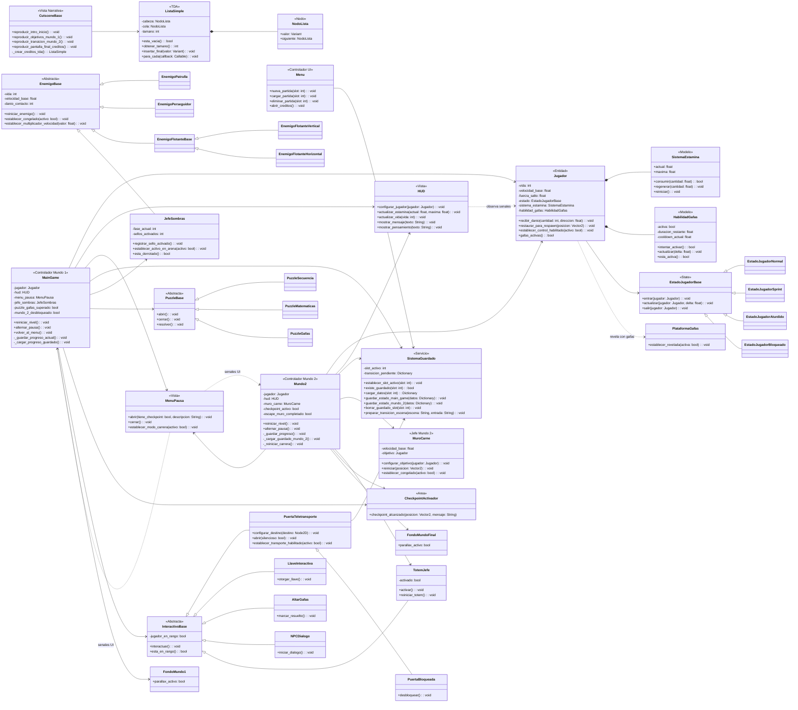

# UML actualizado para Deep Shadow

Este UML representa la estructura actual del proyecto en Godot. La idea principal es separar la coordinacion de cada mundo, las entidades jugables, los sistemas auxiliares y la interfaz. Aunque Godot trabaja con escenas y nodos, el diagrama se centra en las clases propias del proyecto y en sus responsabilidades dentro de Programacion Orientada a Objetos.

## Diagrama de clases

## Patrones y enfoque POO

- `State`: el jugador delega su comportamiento a `EstadoJugadorNormal`, `EstadoJugadorSprint`, `EstadoJugadorAturdido` y `EstadoJugadorBloqueado`, evitando que toda la logica de movimiento quede concentrada en una sola clase.
- `Observer`: se usa por medio de senales de Godot. Por ejemplo, `Jugador` emite cambios de vida, estamina, sprint y gafas; `HUD` escucha esas senales y actualiza la interfaz sin depender de consultas constantes.
- Herencia y polimorfismo: `EnemigoBase`, `PuzzleBase` e `InteractivoBase` son bases comunes para enemigos, puzzles y objetos interactivos. Esto permite agregar variantes sin reescribir los controladores principales.
- Separacion de responsabilidades: `MainGame` y `Mundo2` coordinan el flujo de cada mundo, mientras que `Jugador`, `SistemaEstamina`, `HabilidadGafas`, `SistemaGuardado`, puzzles y enemigos mantienen reglas especificas.

## Uso del TDA Lista Simple

El TDA implementado es `ListaSimple`, una lista enlazada simple creada con nodos propios (`NodoLista`) y referencias `cabeza`, `cola` y `siguiente`. No se usa un `Array` para almacenar los creditos: cada credito se inserta al final con `insertar_final(valor)` y luego se recorre con `para_cada(callback)`. Actualmente se usa en `CutsceneBase`, dentro de `_crear_creditos_tda()`, para construir la secuencia de creditos del juego y renderizar cada fila mediante un callback. Esto permite demostrar una estructura de datos propia, encapsulada y reutilizable.

## Sistema de guardado

El sistema de guardado esta centralizado en `SistemaGuardado`, que maneja tres slots usando archivos `ConfigFile` en `user://deep_shadow_save_slot_%d.cfg`. El menu selecciona, carga o elimina slots; `MainGame` guarda el progreso del mundo 1 y `Mundo2` guarda el progreso de la persecucion, checkpoints, puzzles y posicion de respawn. Al iniciar una escena, cada controlador consulta `SistemaGuardado.cargar_datos()` y reconstruye el estado necesario; para pasar del mundo 1 al mundo 2 se usa una transicion pendiente que indica la escena destino y el punto de entrada.

## Clases principales por archivo

- `Scripts/main_game.gd`: controlador del mundo 1, puertas, jefe, puzzles, checkpoints, HUD, guardado y camaras.
- `Scripts/mundo_2.gd`: controlador del mundo 2, persecucion del muro, checkpoints, puzzle final, camara y guardado.
- `Scripts/jugador.gd`: entidad principal del jugador, movimiento, vida, estamina, gafas, estados y animaciones.
- `Scripts/sistema_guardado.gd`: servicio de persistencia por slots y transiciones.
- `Scripts/tda_lista_simple.gd`: TDA de lista enlazada simple usado en creditos.
- `Scripts/enemigo_base.gd`, `Scripts/jefe_sombras.gd`, `Scripts/muro_carne.gd`: jerarquia de enemigos y jefes.
- `Scripts/puzzle_base.gd`, `Scripts/puzzle_secuencia.gd`, `Scripts/puzzle_matematicas.gd`, `Scripts/puzzle_gafas.gd`: jerarquia de puzzles.
- `Scripts/interactivo_base.gd`, `Scripts/puerta_teletransporte.gd`, `Scripts/puerta_bloqueada.gd`: base de interacciones y puertas.
